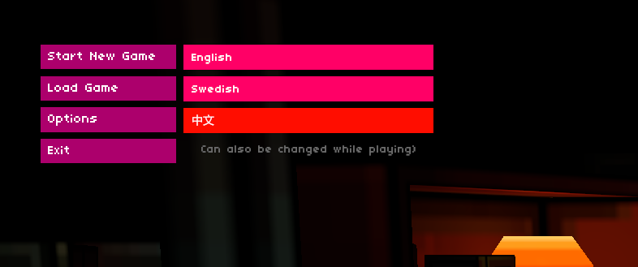
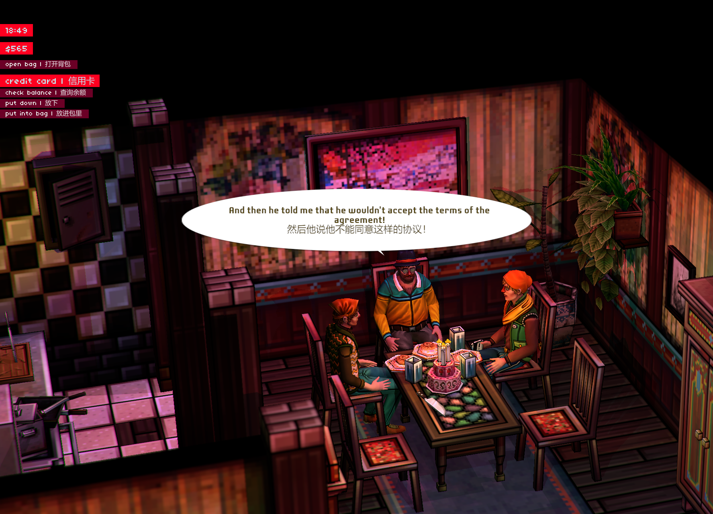
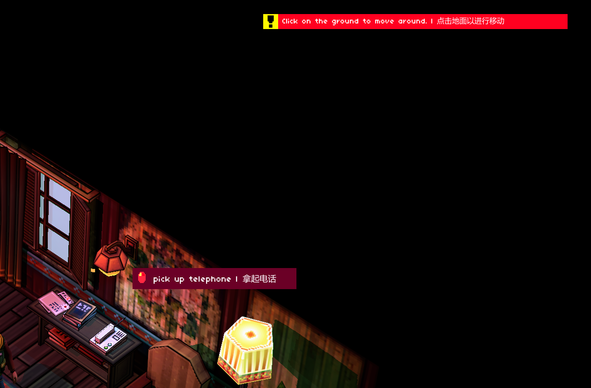

# Else Heartbreak Localization

[中文 README](README_CN.md)

A BepInEx plugin that provides custom language translation support for **Else Heart.Break()**, including menu/UI text, tooltips, MenuItem, notification messages, and adjustable dialogue bubble width for CJK characters.





## Features

- **Toggleable Bilingual Mode**: Toggle between showing English and translated text via hotkey (Default F11)
- **Menu and UI Translation**: Supports translation for tooltips, menuItems, and Notifications
- **Add Custom Language Button**: Automatically adds a language selection button for the corresponding language in the Main Menu and Settings
- **Dialogue Bubble Width**: Configurable bubble width adjustment for CJK characters

## Installation

### Method 1: Download Release (Recommended)
1. Download the latest Release zip package
2. Extract the contents **directly into the game root directory** (`ElseHeartbreak/`), overwriting files with the same name
3. Start the game

### Method 2: Manual Installation
1. Install [BepInEx 5.x](https://github.com/BepInEx/BepInEx) (if not already included)
2. (Optional) Place the BepInEx folder under `ElseHeartbreak_Data/`, and modify `doorstop_config.ini` to change target to `target_assembly=ElseHeartbreak_Data\BepInEx\core\BepInEx.Preloader.dll`
3. Copy the compiled `ElseHeartbreakLocalization.dll` to `ElseHeartbreak_Data/BepInEx/plugins/` (If step 2 was not executed, the BepInEx folder is in the game root directory)
4. Copy `assets/localization.ini` to the game root directory
5. Copy the folders under `resources/` to `ElseHeartbreak_Data/InitData/`

### Configuration

Don't like the terminal window popping up every time you launch the game?

Find the BepInEx folder, and in `BepInEx\config\BepInEx.cfg`, change line 48 `Enabled = true` to `Enabled = false`.

## Directory Structure

After installation, your game directory should look like this:

```
ElseHeartbreak/
├── ElseHeartbreak.exe
├── localization.ini                # Language configuration file
├── doorstop_config.ini             # Doorstop config
├── winhttp.dll                     # Doorstop loader
└── ElseHeartbreak_Data/
    ├── BepInEx/
    │   ├── core/
    │   └── plugins/
    │       └── ElseHeartbreakLocalization.dll
    └── InitData/
        ├── Translations/{Language}/         # Game dialogue translations
        │   └── ...
        └── MenuTranslations/{Language}/     # Menu/UI translations
            ├── tooltips.{idn}.mtf
            └── ...
```

> **Note**: Menu translations must be placed in the `InitData/MenuTranslations/` folder, and **CANNOT** be placed in the `InitData/Translations/` folder. Otherwise, the game's native Translator will try to load them and cause errors.

## Translator Guide

Translations are divided into two parts:
1. **Dialogue Translations**: Located in `Translations/{Language}/`
2. **Menu/UI Translations**: Located in `MenuTranslations/{Language}/`

---

### I. Dialogue Translations (Translations Folder)

This is the **main part** of the translation work, containing dialogue content for all characters in the game.

**Location**: `ElseHeartbreak_Data/InitData/Translations/{Language}/`

**File Naming Format**: `{Character}_{Scene/Event}.{idn}.mtf`

**File Format**:
```
"Original Text" => "Translated Text"
```

> **Tip**: The original game dialogue is in Swedish. You can refer to the English translations in `Translations/English/` to understand the original meaning.

**Dialogue File List** (approx. 358 files):

Main characters include: `Pixie`, `Felix`, `Hank`, `Petra`, `Frank`, `Monad`, `Yulian`, `Fib`, `Ivan`, `Lars`, etc.

Scenes/Events include: `Arrival`, `FirstDay`, `TryFindLodge`, `CasinoHeist`, `HackerTrial1`, `YouAreMemberNow`, etc.

---

### II. Menu/UI Translations (MenuTranslations Folder)

This part is responsible for translating game interface elements: tooltips, menuItems, notification messages, etc.

**Location**: `ElseHeartbreak_Data/InitData/MenuTranslations/{Language}/`

**Menu Translation Files**:

| File | Purpose | Example |
|------|------|------|
| `tooltips.{idn}.mtf` | Item Nouns | door (门), bed (床), computer (电脑) |
| `verbs.{idn}.mtf` | Action Verbs | open (打开), close (关闭), pick up (拾取) |
| `notifications.{idn}.mtf` | System Messages | "Door is locked" (门锁着), "Inventory full" (背包已满) |
| `menutext.{idn}.mtf` | UI Buttons and Labels | "open bag" (打开背包), "give" (给予) |
| `liquidtypes.{idn}.mtf` | Drink Types | beer (啤酒), coffee (咖啡) |
| `drugtypes.{idn}.mtf` | Drug Types | Types of pills |
| `errors.{idn}.mtf` | Error Messages | Error notifications |

---

### Start Translating

1. **Create Language Folders**:
   - Dialogue Translations: `ElseHeartbreak_Data/InitData/Translations/{Language}/`
   - Menu Translations: `ElseHeartbreak_Data/InitData/MenuTranslations/{Language}/`

2. **Copy Example Files**:
   - Dialogue Translations: Copy English versions from `Translations/English/` as reference
   - Menu Translations: Copy templates from `resources/MenuTranslations/Chinese/` in this repository

3. **Edit `localization.ini`**: Add a new language configuration section:

```ini
[Japanese]
Code=jpn
DisplayName=日本語
TranslationFolder=Japanese
FileIdentifier=jpn
CharacterWidthMultiplier=2.0
```

### Translation File Format (.mtf)

Files use a simple key-value format enclosed in quotes, separated by a Fat Arrow:

```
"Original Text" => "Translated Text"
```

Example (`tooltips.chn.mtf`):
```
"door" => "门"
"bed" => "床"
"computer" => "电脑"
```

### [N] Placeholder

For complex phrases involving prepositions, use `[N]` to mark where the object should be inserted:

```
"turn on water in" => "打开[N]的水龙头"
```

When translating `"turn on water in sink"`:
- Plugin detects preposition `" in "`
- Translates object `"sink"` → `"水槽"`
- Result: `"打开水槽的水龙头"`

### Override Files

The plugin will automatically combine verb and noun translations (e.g. `open` + `door` → `开门`). However, sometimes the automatic combination results are not ideal, in which case you can use `_override` files to provide complete phrase translations.

**Use Cases**:
- Automatic combination is unnatural or inaccurate
- Fixed phrases needing special handling
- Translations needing to be completely different from literal meaning

**File Naming**: `{OriginalName}_override.{idn}.mtf`

**Example**: If `verbs.chn.mtf` has `"pick up" => "拾取"`, and `tooltips.chn.mtf` has `"telephone" => "电话"`, the automatic combination result is `"拾取电话"`.

But if you want to translate it as `"拿起电话"`, you can add the following to `menutext_override.chn.mtf`:

```
"pick up telephone" => "拿起电话"
```

**Load Priority** (Later statements override earlier ones):

| Priority | Format | Example |
|--------|------|------|
| 1 (Loads Early) | `{name}.{idn}.mtf` | `verbs.chn.mtf` |
| 2 (Loads Late) | `{name}_override.{idn}.mtf` | `verbs_override.chn.mtf` |


## Configuration

Edit `localization.ini` in the game directory:

```ini
[General]
BilingualModeEnabled=true      ; Show English + Translation
BilingualToggleKey=F11         ; Toggle hotkey
FallbackToEnglish=true         ; Show English if translation missing

[Chinese]
Code=chn
DisplayName=中文
TranslationFolder=Chinese
FileIdentifier=chn
CharacterWidthMultiplier=2.5   ; Dialogue bubble width multiplier for CJK characters
```

### Configuration Parameters

| Parameter | Description |
|------|------|
| `BilingualModeEnabled` | Whether to enable bilingual mode |
| `BilingualToggleKey` | In-game hotkey to toggle bilingual mode |
| `FallbackToEnglish` | Whether to fallback to English when translation is missing |
| `Code` | Internal language code |
| `DisplayName` | Language name displayed on UI |
| `TranslationFolder` | Name of the translation folder |
| `FileIdentifier` | Language identifier in filenames |
| `CharacterWidthMultiplier` | Dialogue bubble width multiplier (2.0-2.5 recommended for CJK) |

## Build from Source

Read the `.csproj` file to ensure corresponding file paths are correct. If not needed, you can also comment out `AfterTargets`.

```powershell
cd ElseHeartbreakLocalization
dotnet build
```

## License and Credits

This project references multiple projects:

### BepInEx
- [BepInEx](https://github.com/BepInEx/BepInEx) Framework
- License: **LGPL-2.1**

### Chinese Translation Text
The Chinese translation text used in the plugin examples is sourced from the [else-heart-break-chinese](https://github.com/1PercentSync/else-heart-break-chinese) project
- License: **CC0-1.0 Universal** (Public Domain)
